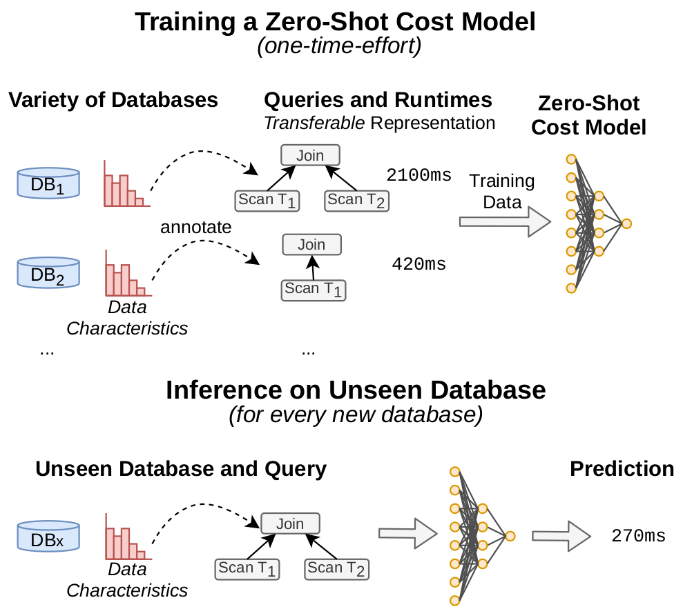

# Zero-Shot Cost Estimation Models

A learned cost model that generalizes to unseen databases and workloads out of the box. This is the implementation
described in

Benjamin Hilprecht and Carsten Binnig: "Zero-Shot Cost Models for Out-of-the-box Learned Cost Prediction", VLDB'2022. [[PDF]](https://arxiv.org/abs/2201.00561)

<p align="center">
  
</p>

## Citation

Please cite our paper, if you find this work useful.

```
@article{DBLP:journals/corr/abs-2201-00561,
  author    = {Benjamin Hilprecht and
               Carsten Binnig},
  title     = {Zero-Shot Cost Models for Out-of-the-box Learned Cost Prediction},
  journal   = {CoRR},
  volume    = {abs/2201.00561},
  year      = {2022},
  url       = {https://arxiv.org/abs/2201.00561},
  eprinttype = {arXiv},
  eprint    = {2201.00561},
  timestamp = {Mon, 10 Jan 2022 13:39:01 +0100},
  biburl    = {https://dblp.org/rec/journals/corr/abs-2201-00561.bib},
  bibsource = {dblp computer science bibliography, https://dblp.org}
}
```

# Table of contents

1. [Main Modules](#modules)
2. [Setup](#setup)
3. [DBGen Benchmark](#dbgenbenchmark)
4. [Train and evaluate a Zero-shot Cost Model](#traineval)
5. [FAQ](#faq)

## Main Modules <a name="modules"></a>

| Module                    | Description                                                                                |
|---------------------------|--------------------------------------------------------------------------------------------|
| cross_db_benchmark        | All code required to reproduce the DBGen benchmark (workload generator, executor, parsing) |
| data_driven_cardinalities | DeepDB code to annotate the query plans with data-driven cardinalities                     |
| models                    | Zero-Shot cost model code                                                                  |
| setup                     | Model hyperparameters and commands to execute DBGen Benchmark                              |

## Setup <a name="setup"></a>

Sets up a virtual environment and install the dependencies. By default, the CPU versions of torch and dgl will be
installed. In case a GPU is available, please install the GPU versions of torch and DGL afterwards. All models of the
paper were trained using GPUs.

```
python3.8 -m venv venv 
source venv/bin/activate
pip3 install --upgrade setuptools
pip3 install --upgrade pip
pip3 install -r requirements.txt
```

In order to annotate cardinalities with DeepDB, you have to install the
additional [requirements](data_driven_cardinalities/deepdb/requirements.txt).

## DBGen Benchmark <a name="dbgenbenchmark"></a>

The DBGen benchmark consists of a variety of relational datasets and workloads. The workloads were executed on postgres
and the plans were extracted and are also made available as part of this benchmark.

### Fast-Forward

You can download the preprocessed workloads and directly start training zero-shot cost models on them. For this, please
download all folders and code from this
[data repository](https://osf.io/ga2xj/?view_only=60916f2446e844edb32e3b4d676cb6ee)
and place both code and data in some directory. Afterwards please unzip all zipped folders in their respective
directory. Now you can skip all the following steps (in Step-by-Step) and directly execute the training.

### Reproduce entire DBGen benchmark

If you want to also reproduce how queries were run and parsed, execute the following commands. Note that you still have
to download the code and data from the
[data repository](https://osf.io/ga2xj/?view_only=60916f2446e844edb32e3b4d676cb6ee). Afterwards, download missing
datasets from the relational fit website by using the following script. Note that this step requires the mysql client
which on Ubuntu can be installed via `apt install mysql-client`.

```
python3 dbgensetup.py --download_relational_fit --data_dir ../zero-shot-data/datasets
```

Scale the datasets to an appropriate size.

```
python3 dbgensetup.py --scale_datasets --data_dir ../zero-shot-data/datasets
```

Load the datasets into a postgres instance (requires that there is a local Postgres instance running).

```
python3 dbgensetup.py --load_database --data_dir ../zero-shot-data/datasets --database_conn user=postgres,password=postgres,host=localhost 
```

Generate the workloads.

```
python3 dbgensetup.py --generate_workloads --workload_dir ../zero-shot-data/workloads
```

Run the workloads on a postgres instance. This script will generate all python commands that have to be executed.

```
python3 dbgensetup.py --print_run_commands
```

Parse the workloads.

```
python3 dbgensetup.py --parse_all_queries --raw_dir ../zero-shot-data/runs/raw --parsed_plan_dir ../zero-shot-data/runs/parsed_plans --workloads workload_100k_s1_c8220.json complex_workload_200k_s1_c8220.json index_workload_100k_s2_c8220.json synthetic_c8220.json scale_c8220.json job-light_c8220.json --target_stats_path experiments/data/statistics/postgres_workload_stats.csv --min_query_ms 100
```

In an additional step, we can replace the estimated cardinalities of postgres by those of DeepDB. For this, please refer
to the separate [README](data_driven_cardinalities/deepdb/README.md).

## Train and evaluate a Zero-shot Cost Model <a name="traineval"></a>

In order to train a zero-shot model on a variety of training workloads, we first have to construct some metadata about
the workloads (such as which physical plan operators occur etc.). This is an automated step. The two commands below
execute this step (once for the standard+index workloads (where DeepDB cardinalities are available) and once for the
standard+complex workloads (where we can only use exact or Postgres estimated cardinalities)).

```
python3 train.py --gather_feature_statistics --workload_runs workload_100k_s1_c8220.json index_workload_100k_s2_c8220.json synthetic_c8220.json scale_c8220.json job-light_c8220.json --raw_dir ../zero-shot-data/runs/deepdb_augmented --target ../zero-shot-data/runs/deepdb_augmented/statistics_workload_combined.json
python3 train.py --gather_feature_statistics --workload_runs workload_100k_s1_c8220.json complex_workload_200k_s1_c8220.json index_workload_100k_s2_c8220.json --raw_dir ../zero-shot-data/runs/parsed_plans --target ../zero-shot-data/runs/parsed_plans/statistics_workload_combined.json
```

We are now ready to train a zero-shot model and evaluate it on some workload on an unseen database. Note that with the
hyperparameters we can control, which cardinalities should be used (exact, DeepDB estimated and estimated from
Postgres):

```
Exact Cards: setup/tuned_hyperparameters/tune_best_config.json 
DeepDB Cards: setup/tuned_hyperparameters/tune_deepdb_best_config.json 
Postgres Cards: setup/tuned_hyperparameters/tune_est_best_config.json 
```

The commands to train a zero-shot cost model on 19 databases and test it on IMDB are as follows (make sure to use the
right feature statistics depending on whether you use `deepdb_augmented` or `parsed_plans` plans (i.e., with Postgres
cardinality estimates only). The commands below are correct.):

```
# Test workloads on IMDB (JOB-light, synthetic,scale), train on 19 other DBs
# DeepDB Cards
python3 train.py --train_model --workload_runs ../zero-shot-data/runs/deepdb_augmented/airline/index_workload_100k_s2_c8220.json ../zero-shot-data/runs/deepdb_augmented/airline/workload_100k_s1_c8220.json ../zero-shot-data/runs/deepdb_augmented/ssb/index_workload_100k_s2_c8220.json ../zero-shot-data/runs/deepdb_augmented/ssb/workload_100k_s1_c8220.json ../zero-shot-data/runs/deepdb_augmented/tpc_h/index_workload_100k_s2_c8220.json ../zero-shot-data/runs/deepdb_augmented/tpc_h/workload_100k_s1_c8220.json ../zero-shot-data/runs/deepdb_augmented/walmart/index_workload_100k_s2_c8220.json ../zero-shot-data/runs/deepdb_augmented/walmart/workload_100k_s1_c8220.json ../zero-shot-data/runs/deepdb_augmented/financial/index_workload_100k_s2_c8220.json ../zero-shot-data/runs/deepdb_augmented/financial/workload_100k_s1_c8220.json ../zero-shot-data/runs/deepdb_augmented/basketball/index_workload_100k_s2_c8220.json ../zero-shot-data/runs/deepdb_augmented/basketball/workload_100k_s1_c8220.json ../zero-shot-data/runs/deepdb_augmented/accidents/index_workload_100k_s2_c8220.json ../zero-shot-data/runs/deepdb_augmented/accidents/workload_100k_s1_c8220.json ../zero-shot-data/runs/deepdb_augmented/movielens/index_workload_100k_s2_c8220.json ../zero-shot-data/runs/deepdb_augmented/movielens/workload_100k_s1_c8220.json ../zero-shot-data/runs/deepdb_augmented/baseball/index_workload_100k_s2_c8220.json ../zero-shot-data/runs/deepdb_augmented/baseball/workload_100k_s1_c8220.json ../zero-shot-data/runs/deepdb_augmented/hepatitis/index_workload_100k_s2_c8220.json ../zero-shot-data/runs/deepdb_augmented/hepatitis/workload_100k_s1_c8220.json ../zero-shot-data/runs/deepdb_augmented/tournament/index_workload_100k_s2_c8220.json ../zero-shot-data/runs/deepdb_augmented/tournament/workload_100k_s1_c8220.json ../zero-shot-data/runs/deepdb_augmented/credit/index_workload_100k_s2_c8220.json ../zero-shot-data/runs/deepdb_augmented/credit/workload_100k_s1_c8220.json ../zero-shot-data/runs/deepdb_augmented/employee/index_workload_100k_s2_c8220.json ../zero-shot-data/runs/deepdb_augmented/employee/workload_100k_s1_c8220.json ../zero-shot-data/runs/deepdb_augmented/consumer/index_workload_100k_s2_c8220.json ../zero-shot-data/runs/deepdb_augmented/consumer/workload_100k_s1_c8220.json ../zero-shot-data/runs/deepdb_augmented/geneea/index_workload_100k_s2_c8220.json ../zero-shot-data/runs/deepdb_augmented/geneea/workload_100k_s1_c8220.json ../zero-shot-data/runs/deepdb_augmented/genome/index_workload_100k_s2_c8220.json ../zero-shot-data/runs/deepdb_augmented/genome/workload_100k_s1_c8220.json ../zero-shot-data/runs/deepdb_augmented/carcinogenesis/index_workload_100k_s2_c8220.json ../zero-shot-data/runs/deepdb_augmented/carcinogenesis/workload_100k_s1_c8220.json ../zero-shot-data/runs/deepdb_augmented/seznam/index_workload_100k_s2_c8220.json ../zero-shot-data/runs/deepdb_augmented/seznam/workload_100k_s1_c8220.json ../zero-shot-data/runs/deepdb_augmented/fhnk/index_workload_100k_s2_c8220.json ../zero-shot-data/runs/deepdb_augmented/fhnk/workload_100k_s1_c8220.json --test_workload_runs ../zero-shot-data/runs/deepdb_augmented/imdb/index_workload_100k_s2_c8220.json ../zero-shot-data/runs/deepdb_augmented/imdb/workload_100k_s1_c8220.json ../zero-shot-data/runs/deepdb_augmented/imdb/synthetic_c8220.json ../zero-shot-data/runs/deepdb_augmented/imdb/scale_c8220.json ../zero-shot-data/runs/deepdb_augmented/imdb/job-light_c8220.json --statistics_file ../zero-shot-data/runs/deepdb_augmented/statistics_workload_combined.json --target ../zero-shot-data/evaluation/db_generalization_tune_deepdb/ --hyperparameter_path setup/tuned_hyperparameters/tune_deepdb_best_config.json --max_epoch_tuples 100000 --loss_class_name QLoss  --device cuda:0 --filename_model imdb_0 --num_workers 16 --database postgres --seed 0
# Exact Cards
python3 train.py --train_model --workload_runs ../zero-shot-data/runs/deepdb_augmented/airline/index_workload_100k_s2_c8220.json ../zero-shot-data/runs/deepdb_augmented/airline/workload_100k_s1_c8220.json ../zero-shot-data/runs/deepdb_augmented/ssb/index_workload_100k_s2_c8220.json ../zero-shot-data/runs/deepdb_augmented/ssb/workload_100k_s1_c8220.json ../zero-shot-data/runs/deepdb_augmented/tpc_h/index_workload_100k_s2_c8220.json ../zero-shot-data/runs/deepdb_augmented/tpc_h/workload_100k_s1_c8220.json ../zero-shot-data/runs/deepdb_augmented/walmart/index_workload_100k_s2_c8220.json ../zero-shot-data/runs/deepdb_augmented/walmart/workload_100k_s1_c8220.json ../zero-shot-data/runs/deepdb_augmented/financial/index_workload_100k_s2_c8220.json ../zero-shot-data/runs/deepdb_augmented/financial/workload_100k_s1_c8220.json ../zero-shot-data/runs/deepdb_augmented/basketball/index_workload_100k_s2_c8220.json ../zero-shot-data/runs/deepdb_augmented/basketball/workload_100k_s1_c8220.json ../zero-shot-data/runs/deepdb_augmented/accidents/index_workload_100k_s2_c8220.json ../zero-shot-data/runs/deepdb_augmented/accidents/workload_100k_s1_c8220.json ../zero-shot-data/runs/deepdb_augmented/movielens/index_workload_100k_s2_c8220.json ../zero-shot-data/runs/deepdb_augmented/movielens/workload_100k_s1_c8220.json ../zero-shot-data/runs/deepdb_augmented/baseball/index_workload_100k_s2_c8220.json ../zero-shot-data/runs/deepdb_augmented/baseball/workload_100k_s1_c8220.json ../zero-shot-data/runs/deepdb_augmented/hepatitis/index_workload_100k_s2_c8220.json ../zero-shot-data/runs/deepdb_augmented/hepatitis/workload_100k_s1_c8220.json ../zero-shot-data/runs/deepdb_augmented/tournament/index_workload_100k_s2_c8220.json ../zero-shot-data/runs/deepdb_augmented/tournament/workload_100k_s1_c8220.json ../zero-shot-data/runs/deepdb_augmented/credit/index_workload_100k_s2_c8220.json ../zero-shot-data/runs/deepdb_augmented/credit/workload_100k_s1_c8220.json ../zero-shot-data/runs/deepdb_augmented/employee/index_workload_100k_s2_c8220.json ../zero-shot-data/runs/deepdb_augmented/employee/workload_100k_s1_c8220.json ../zero-shot-data/runs/deepdb_augmented/consumer/index_workload_100k_s2_c8220.json ../zero-shot-data/runs/deepdb_augmented/consumer/workload_100k_s1_c8220.json ../zero-shot-data/runs/deepdb_augmented/geneea/index_workload_100k_s2_c8220.json ../zero-shot-data/runs/deepdb_augmented/geneea/workload_100k_s1_c8220.json ../zero-shot-data/runs/deepdb_augmented/genome/index_workload_100k_s2_c8220.json ../zero-shot-data/runs/deepdb_augmented/genome/workload_100k_s1_c8220.json ../zero-shot-data/runs/deepdb_augmented/carcinogenesis/index_workload_100k_s2_c8220.json ../zero-shot-data/runs/deepdb_augmented/carcinogenesis/workload_100k_s1_c8220.json ../zero-shot-data/runs/deepdb_augmented/seznam/index_workload_100k_s2_c8220.json ../zero-shot-data/runs/deepdb_augmented/seznam/workload_100k_s1_c8220.json ../zero-shot-data/runs/deepdb_augmented/fhnk/index_workload_100k_s2_c8220.json ../zero-shot-data/runs/deepdb_augmented/fhnk/workload_100k_s1_c8220.json --test_workload_runs ../zero-shot-data/runs/deepdb_augmented/imdb/index_workload_100k_s2_c8220.json ../zero-shot-data/runs/deepdb_augmented/imdb/workload_100k_s1_c8220.json ../zero-shot-data/runs/deepdb_augmented/imdb/synthetic_c8220.json ../zero-shot-data/runs/deepdb_augmented/imdb/scale_c8220.json ../zero-shot-data/runs/deepdb_augmented/imdb/job-light_c8220.json --statistics_file ../zero-shot-data/runs/deepdb_augmented/statistics_workload_combined.json --target ../zero-shot-data/evaluation/db_generalization_tune/ --hyperparameter_path setup/tuned_hyperparameters/tune_best_config.json --max_epoch_tuples 100000 --loss_class_name QLoss  --device cuda:0 --filename_model imdb_0 --num_workers 16 --database postgres --seed 0
# Postgres Cards
python3 train.py --train_model --workload_runs ../zero-shot-data/runs/deepdb_augmented/airline/index_workload_100k_s2_c8220.json ../zero-shot-data/runs/deepdb_augmented/airline/workload_100k_s1_c8220.json ../zero-shot-data/runs/deepdb_augmented/ssb/index_workload_100k_s2_c8220.json ../zero-shot-data/runs/deepdb_augmented/ssb/workload_100k_s1_c8220.json ../zero-shot-data/runs/deepdb_augmented/tpc_h/index_workload_100k_s2_c8220.json ../zero-shot-data/runs/deepdb_augmented/tpc_h/workload_100k_s1_c8220.json ../zero-shot-data/runs/deepdb_augmented/walmart/index_workload_100k_s2_c8220.json ../zero-shot-data/runs/deepdb_augmented/walmart/workload_100k_s1_c8220.json ../zero-shot-data/runs/deepdb_augmented/financial/index_workload_100k_s2_c8220.json ../zero-shot-data/runs/deepdb_augmented/financial/workload_100k_s1_c8220.json ../zero-shot-data/runs/deepdb_augmented/basketball/index_workload_100k_s2_c8220.json ../zero-shot-data/runs/deepdb_augmented/basketball/workload_100k_s1_c8220.json ../zero-shot-data/runs/deepdb_augmented/accidents/index_workload_100k_s2_c8220.json ../zero-shot-data/runs/deepdb_augmented/accidents/workload_100k_s1_c8220.json ../zero-shot-data/runs/deepdb_augmented/movielens/index_workload_100k_s2_c8220.json ../zero-shot-data/runs/deepdb_augmented/movielens/workload_100k_s1_c8220.json ../zero-shot-data/runs/deepdb_augmented/baseball/index_workload_100k_s2_c8220.json ../zero-shot-data/runs/deepdb_augmented/baseball/workload_100k_s1_c8220.json ../zero-shot-data/runs/deepdb_augmented/hepatitis/index_workload_100k_s2_c8220.json ../zero-shot-data/runs/deepdb_augmented/hepatitis/workload_100k_s1_c8220.json ../zero-shot-data/runs/deepdb_augmented/tournament/index_workload_100k_s2_c8220.json ../zero-shot-data/runs/deepdb_augmented/tournament/workload_100k_s1_c8220.json ../zero-shot-data/runs/deepdb_augmented/credit/index_workload_100k_s2_c8220.json ../zero-shot-data/runs/deepdb_augmented/credit/workload_100k_s1_c8220.json ../zero-shot-data/runs/deepdb_augmented/employee/index_workload_100k_s2_c8220.json ../zero-shot-data/runs/deepdb_augmented/employee/workload_100k_s1_c8220.json ../zero-shot-data/runs/deepdb_augmented/consumer/index_workload_100k_s2_c8220.json ../zero-shot-data/runs/deepdb_augmented/consumer/workload_100k_s1_c8220.json ../zero-shot-data/runs/deepdb_augmented/geneea/index_workload_100k_s2_c8220.json ../zero-shot-data/runs/deepdb_augmented/geneea/workload_100k_s1_c8220.json ../zero-shot-data/runs/deepdb_augmented/genome/index_workload_100k_s2_c8220.json ../zero-shot-data/runs/deepdb_augmented/genome/workload_100k_s1_c8220.json ../zero-shot-data/runs/deepdb_augmented/carcinogenesis/index_workload_100k_s2_c8220.json ../zero-shot-data/runs/deepdb_augmented/carcinogenesis/workload_100k_s1_c8220.json ../zero-shot-data/runs/deepdb_augmented/seznam/index_workload_100k_s2_c8220.json ../zero-shot-data/runs/deepdb_augmented/seznam/workload_100k_s1_c8220.json ../zero-shot-data/runs/deepdb_augmented/fhnk/index_workload_100k_s2_c8220.json ../zero-shot-data/runs/deepdb_augmented/fhnk/workload_100k_s1_c8220.json --test_workload_runs ../zero-shot-data/runs/deepdb_augmented/imdb/index_workload_100k_s2_c8220.json ../zero-shot-data/runs/deepdb_augmented/imdb/workload_100k_s1_c8220.json ../zero-shot-data/runs/deepdb_augmented/imdb/synthetic_c8220.json ../zero-shot-data/runs/deepdb_augmented/imdb/scale_c8220.json ../zero-shot-data/runs/deepdb_augmented/imdb/job-light_c8220.json --statistics_file ../zero-shot-data/runs/deepdb_augmented/statistics_workload_combined.json --target ../zero-shot-data/evaluation/db_generalization_tune_est/ --hyperparameter_path setup/tuned_hyperparameters/tune_est_best_config.json --max_epoch_tuples 100000 --loss_class_name QLoss  --device cuda:0 --filename_model imdb_0 --num_workers 16 --database postgres --seed 0

# JOB Benchmark as Test Workload
# Exact Cards
python3 train.py --train_model --workload_runs ../zero-shot-data/runs/parsed_plans/airline/complex_workload_200k_s1_c8220.json ../zero-shot-data/runs/parsed_plans/airline/workload_100k_s1_c8220.json ../zero-shot-data/runs/parsed_plans/ssb/complex_workload_200k_s1_c8220.json ../zero-shot-data/runs/parsed_plans/ssb/workload_100k_s1_c8220.json ../zero-shot-data/runs/parsed_plans/tpc_h/complex_workload_200k_s1_c8220.json ../zero-shot-data/runs/parsed_plans/tpc_h/workload_100k_s1_c8220.json ../zero-shot-data/runs/parsed_plans/walmart/complex_workload_200k_s1_c8220.json ../zero-shot-data/runs/parsed_plans/walmart/workload_100k_s1_c8220.json ../zero-shot-data/runs/parsed_plans/financial/complex_workload_200k_s1_c8220.json ../zero-shot-data/runs/parsed_plans/financial/workload_100k_s1_c8220.json ../zero-shot-data/runs/parsed_plans/basketball/complex_workload_200k_s1_c8220.json ../zero-shot-data/runs/parsed_plans/basketball/workload_100k_s1_c8220.json ../zero-shot-data/runs/parsed_plans/accidents/complex_workload_200k_s1_c8220.json ../zero-shot-data/runs/parsed_plans/accidents/workload_100k_s1_c8220.json ../zero-shot-data/runs/parsed_plans/movielens/complex_workload_200k_s1_c8220.json ../zero-shot-data/runs/parsed_plans/movielens/workload_100k_s1_c8220.json ../zero-shot-data/runs/parsed_plans/baseball/complex_workload_200k_s1_c8220.json ../zero-shot-data/runs/parsed_plans/baseball/workload_100k_s1_c8220.json ../zero-shot-data/runs/parsed_plans/hepatitis/complex_workload_200k_s1_c8220.json ../zero-shot-data/runs/parsed_plans/hepatitis/workload_100k_s1_c8220.json ../zero-shot-data/runs/parsed_plans/tournament/complex_workload_200k_s1_c8220.json ../zero-shot-data/runs/parsed_plans/tournament/workload_100k_s1_c8220.json ../zero-shot-data/runs/parsed_plans/credit/complex_workload_200k_s1_c8220.json ../zero-shot-data/runs/parsed_plans/credit/workload_100k_s1_c8220.json ../zero-shot-data/runs/parsed_plans/employee/complex_workload_200k_s1_c8220.json ../zero-shot-data/runs/parsed_plans/employee/workload_100k_s1_c8220.json ../zero-shot-data/runs/parsed_plans/consumer/complex_workload_200k_s1_c8220.json ../zero-shot-data/runs/parsed_plans/consumer/workload_100k_s1_c8220.json ../zero-shot-data/runs/parsed_plans/geneea/complex_workload_200k_s1_c8220.json ../zero-shot-data/runs/parsed_plans/geneea/workload_100k_s1_c8220.json ../zero-shot-data/runs/parsed_plans/genome/complex_workload_200k_s1_c8220.json ../zero-shot-data/runs/parsed_plans/genome/workload_100k_s1_c8220.json ../zero-shot-data/runs/parsed_plans/carcinogenesis/complex_workload_200k_s1_c8220.json ../zero-shot-data/runs/parsed_plans/carcinogenesis/workload_100k_s1_c8220.json ../zero-shot-data/runs/parsed_plans/seznam/complex_workload_200k_s1_c8220.json ../zero-shot-data/runs/parsed_plans/seznam/workload_100k_s1_c8220.json ../zero-shot-data/runs/parsed_plans/fhnk/complex_workload_200k_s1_c8220.json ../zero-shot-data/runs/parsed_plans/fhnk/workload_100k_s1_c8220.json --test_workload_runs ../zero-shot-data/runs/parsed_plans/imdb_full/job_full_c8220.json --statistics_file ../zero-shot-data/runs/parsed_plans/statistics_workload_combined.json --target ../zero-shot-data/evaluation/job_full_tune/ --hyperparameter_path setup/tuned_hyperparameters/tune_best_config.json --max_epoch_tuples 100000 --loss_class_name QLoss  --device cuda:0 --filename_model imdb_full_0 --num_workers 16 --database postgres --seed 0
# Postgres Cards
python3 train.py --train_model --workload_runs ../zero-shot-data/runs/parsed_plans/airline/complex_workload_200k_s1_c8220.json ../zero-shot-data/runs/parsed_plans/airline/workload_100k_s1_c8220.json ../zero-shot-data/runs/parsed_plans/ssb/complex_workload_200k_s1_c8220.json ../zero-shot-data/runs/parsed_plans/ssb/workload_100k_s1_c8220.json ../zero-shot-data/runs/parsed_plans/tpc_h/complex_workload_200k_s1_c8220.json ../zero-shot-data/runs/parsed_plans/tpc_h/workload_100k_s1_c8220.json ../zero-shot-data/runs/parsed_plans/walmart/complex_workload_200k_s1_c8220.json ../zero-shot-data/runs/parsed_plans/walmart/workload_100k_s1_c8220.json ../zero-shot-data/runs/parsed_plans/financial/complex_workload_200k_s1_c8220.json ../zero-shot-data/runs/parsed_plans/financial/workload_100k_s1_c8220.json ../zero-shot-data/runs/parsed_plans/basketball/complex_workload_200k_s1_c8220.json ../zero-shot-data/runs/parsed_plans/basketball/workload_100k_s1_c8220.json ../zero-shot-data/runs/parsed_plans/accidents/complex_workload_200k_s1_c8220.json ../zero-shot-data/runs/parsed_plans/accidents/workload_100k_s1_c8220.json ../zero-shot-data/runs/parsed_plans/movielens/complex_workload_200k_s1_c8220.json ../zero-shot-data/runs/parsed_plans/movielens/workload_100k_s1_c8220.json ../zero-shot-data/runs/parsed_plans/baseball/complex_workload_200k_s1_c8220.json ../zero-shot-data/runs/parsed_plans/baseball/workload_100k_s1_c8220.json ../zero-shot-data/runs/parsed_plans/hepatitis/complex_workload_200k_s1_c8220.json ../zero-shot-data/runs/parsed_plans/hepatitis/workload_100k_s1_c8220.json ../zero-shot-data/runs/parsed_plans/tournament/complex_workload_200k_s1_c8220.json ../zero-shot-data/runs/parsed_plans/tournament/workload_100k_s1_c8220.json ../zero-shot-data/runs/parsed_plans/credit/complex_workload_200k_s1_c8220.json ../zero-shot-data/runs/parsed_plans/credit/workload_100k_s1_c8220.json ../zero-shot-data/runs/parsed_plans/employee/complex_workload_200k_s1_c8220.json ../zero-shot-data/runs/parsed_plans/employee/workload_100k_s1_c8220.json ../zero-shot-data/runs/parsed_plans/consumer/complex_workload_200k_s1_c8220.json ../zero-shot-data/runs/parsed_plans/consumer/workload_100k_s1_c8220.json ../zero-shot-data/runs/parsed_plans/geneea/complex_workload_200k_s1_c8220.json ../zero-shot-data/runs/parsed_plans/geneea/workload_100k_s1_c8220.json ../zero-shot-data/runs/parsed_plans/genome/complex_workload_200k_s1_c8220.json ../zero-shot-data/runs/parsed_plans/genome/workload_100k_s1_c8220.json ../zero-shot-data/runs/parsed_plans/carcinogenesis/complex_workload_200k_s1_c8220.json ../zero-shot-data/runs/parsed_plans/carcinogenesis/workload_100k_s1_c8220.json ../zero-shot-data/runs/parsed_plans/seznam/complex_workload_200k_s1_c8220.json ../zero-shot-data/runs/parsed_plans/seznam/workload_100k_s1_c8220.json ../zero-shot-data/runs/parsed_plans/fhnk/complex_workload_200k_s1_c8220.json ../zero-shot-data/runs/parsed_plans/fhnk/workload_100k_s1_c8220.json --test_workload_runs ../zero-shot-data/runs/parsed_plans/imdb_full/job_full_c8220.json --statistics_file ../zero-shot-data/runs/parsed_plans/statistics_workload_combined.json --target ../zero-shot-data/evaluation/job_full_tune_est/ --hyperparameter_path setup/tuned_hyperparameters/tune_est_best_config.json --max_epoch_tuples 100000 --loss_class_name QLoss  --device cuda:0 --filename_model imdb_full_0 --num_workers 16 --database postgres --seed 0
```

## FAQ <a name="faq"></a>

### How do I port this to another database system beyond PostgreSQL?

The most important conceptual task to support a new DBMS is to a) select the transferable features which can be
extracted from the plans and statistics, and b) extend the zero shot graph to represent a query by potentially adding
new node types to holistically represent the query. For instance, in the arxiv paper to support a cloud data warehouse,
we added node types to represent the scanened columns since the storage was a column store and specialized operator
nodes for distributed joins (e.g., a shuffle operator).

Conceptually, the code is already implemented in a way that makes it easy to add another database. Simply look for code
paths which are called "postgres". Usually, there is already a case distinction in case other DBMSs should be added in
the future. In particular, for the zero-shot models, you have to implement a method to construct the graphs (similar
to `postgres_plan_batching.py`) and create a subclass for your zero-shot model (similar to `postgres_zero_shot.py`).

In addition, you have to provide some parser that transforms EXPLAIN plans to graphs that the ML models can process.
Moreover, you of course have to provide additional training data since we only provide training data for PostgreSQL at
the moment.

### How do I add another dataset?

First, provide the csv files of the new dataset in some folder, e.g., `../zero-shot-data/datasets/ssb`. Afterwards, add
a folder to `cross_db_benchmark/datasets` similar to the other datasets. You can automatically generate string and
column statistics as follows.

```
python3 dbgensetup.py --generate_column_statistics --dataset ssb --data_dir ../zero-shot-data/datasets/ssb
python3 dbgensetup.py --generate_string_statistics --dataset ssb --data_dir ../zero-shot-data/datasets/ssb
```

Afterwards, integrate the dataset into the `database_list` in the `datasets.py` file to consider the file in the
workload generation etc.

### The parser does not work for my queries. What should I do?

In general, we believe that zero-shot cost models are broadly applicable. However, this is just a prototype
implementation that comes with several limitations. Hence, the code is in particular not intended to be used in any
production system at the current state.

Most importantly, the parser does not yet support all potential explain plans. Probably there is some fix that solves
the issue with the parser in your particular case. In general, we would recommend reimplementing the parser since we
believe it can be greatly simplified by a) using the JSON outputs of the postgres EXPLAIN plans and b) parsing filters
etc. with a grammar. 
